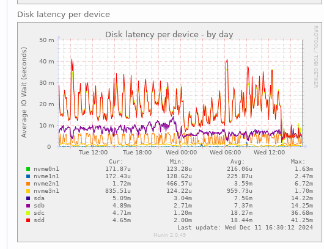
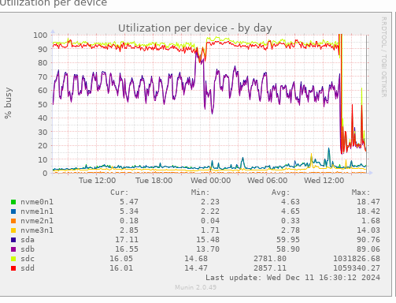

# 2024-12-11 Firmware upgrade on off2

We noticed that on off2, the latency was really high for two of the hard drives,
namely sdc and sdd.

After some research, Christian found that it could be linked to an old firmware on the disks.

## Preparation

We can see firmware version by using (here for sdd):
```bash
smartctl -a /dev/sdd|grep -i firmware
```
It was `GB01` on the two culprits, while it was `GB03` on the others.

Christian downloaded the firmware update for the disks,
it comes as an installer: `Serial-ATA_Firmware_0942Y_LN_GB03_A00.BIN`

You can find it by using the "Device Model" entry from `smartctl -a` (here `TOSHIBA MG07ACA14TEY`)
and search for firmwaon the flyre. You land on `https://www.dell.com/support/home/fr-fr/drivers/driversdetails?driverid=0942y`


## Changing the firmware

The firmware update is happening on all disk on the server.

We just run the program as root and it went smoothly.

But we wanted to be sure that the firmware upgrade was taken into account
(we didn't have the time to wait for a check,
and where not sure of the figure seen with `zpool iostat`).

So we decided to remove and re-add the disks to the server.
Because our ZFS is raidz we can remove one disk at a time without losing data,
and because we will remove it only for a short period, re-silver will be fast.

So we removed sdd from ZFS pools
```bash
zpool offline zfs-hdd sdd4
# for rpool the name is different, but we can recognize thanks to the serial number (smartctl -a gives it)
zpool offline rpool ata-TOSHIBA_MG07ACA14TEY_X8F0A0H8F9RG-part3
```

We unplugged the disk and plugged it back in.

Then we re-added it to the ZFS pools:
```bash
zpool online zfs-hdd sdd4
zpool online rpool ata-TOSHIBA_MG07ACA14TEY_X8F0A0H8F9RG-part3
```

We then wait for re-silver to be completed, zpool status displays if a resilver is in progress or done:
```bash
zpool status
```
It was almost instantaneous.

We did the same operation for the other disk, `sdc`.

Note: we did not offlined the disk from rpool because we forgot to do it. It went well the same,
because ZFS was resilient enough and did the resilver automatically.


## Result

The result is easy to see in munin:




